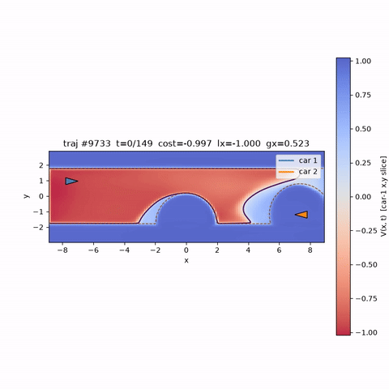
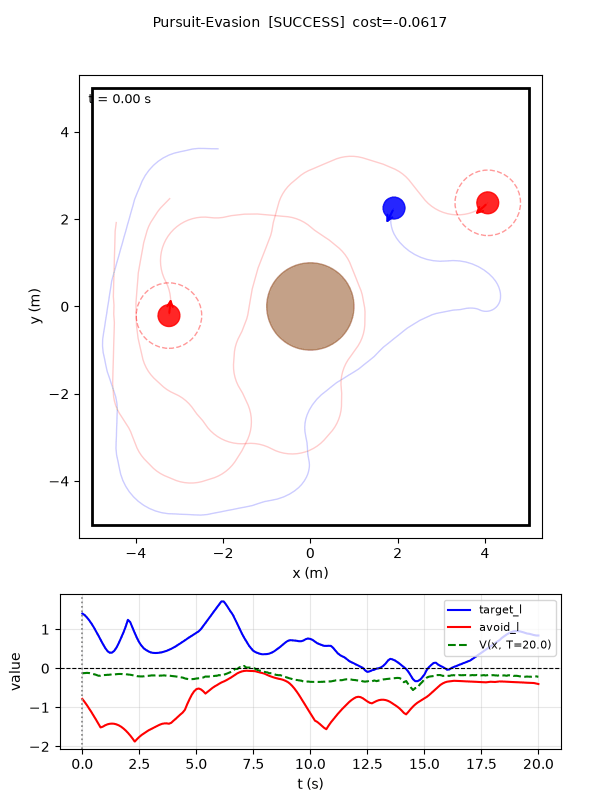
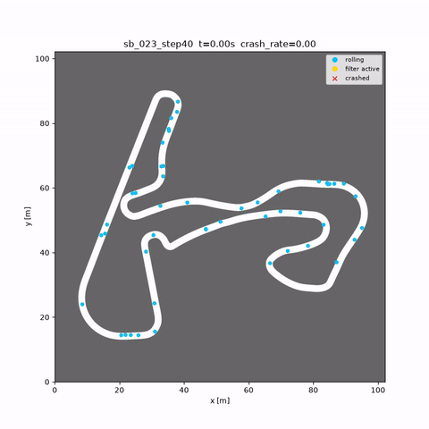

# Gradient-Free Neural Hamilton-Jacobi Reachability

A gradient-free framework that scales Hamilton-Jacobi
reachability more robustly and efficiently to high-dimensional systems. 
It computes Backward Reachable Tubes (BRT), Backward Reachable Sets (BRS), and Backward Reachable Avoid Tubes (BRAT) for optimal control problems, robust optimal control problems, and two-player zero-sum games. 
We additionally include implementation for a least-restrictive safety filter and a sampling-based DCBF filter for deployment.

We migrated our original code to this JAX implementation. So, please expect better performance and less training time than those reported in the paper XD.
> **Paper:** *Gradient-Free Neural Hamilton-Jacobi Reachability for Scalable
> Safety-Critical Control* — Z. Feng, A. F. Sahin, S. Thorup, S. Bansal. CoRL 2026.


---

## High-Level Structure

| Path | Description |
|---|---|
| `train.py` | Training entry point. |
| `eval.py` | Learned solution evaluation. |
| `eval_lesslinear.py` | Evaluation against the ground-truth for the publisher-subscriber system. |
| `f1tenth_filter_eval.py` | F1Tenth safety-filter closed-loop eval with a poorly-tuned MPPI nominal controller. |
| `evade_pursuit_sim.py` | Animation for the pursuit-evasion game. |
| `evade_pursuit_sim_keyboard.py` | Interactive pursuit-evasion game (human v.s. AI). |
| `configs/default_config.py` | Define default hyperparameters. |
| `reachability/dynamics/` | Dynamical systems. This is the only place that you need to touch for defining your own reachability problem. |
| `reachability/modules/` | Networks. |
| `reachability/training/` | `trainer.py` (curriculum/checkpointing), `engine.py` (`HJSolver`: targets, rollouts, probing), `functional.py`, `losses.py`, `strategy.py`. |
| `reachability/data/` | `sampling.py` (uniform + boundary-aware sampler), `anchor.py` (finetune anchor datasets). |
| `reachability/eval/` | `metrics.py`, and the F1Tenth filter + MPPI eval (`f1tenth_filter.py`, `f1tenth_mppi.py`). |
| `reachability/animation/` | Per-system trajectory animations. |
| `datasets/ego_bev.py` | F1Tenth ego-BEV renderer and signed-distance function. |
| `tracks/` | F1Tenth tracks (`<id>/<id>.png` + `map_info.yaml`). Most of the tracks are borrowed from https://github.com/f1tenth/f1tenth_racetracks. Big thanks to them! |


---

## Environment Setup

```bash
python -m venv .venv && source .venv/bin/activate
pip install -r requirements.txt
```
Don't forget to activate the venv every time before launching a script.

`requirements.txt` deliberately omits JAX so you pick the build for your hardware. Some example commands for installing it separately:

```bash
pip install "jax[cuda12]==0.10.2"   # GPU (CUDA 12)
pip install "jax==0.10.2"           # CPU-only
```

(Optional) JAX preallocates most of the GPU by default; cap it when sharing a card:

```bash
export XLA_PYTHON_CLIENT_MEM_FRACTION=0.5
```

Tested on Ubuntu 24.04 with Python 3.11, JAX 0.10.2 (CUDA 12 build), and a single NVIDIA RTX 6000 Pro GPU. 


---

## Running an Experiment

Training results are saved to `runs/<IO.EXP_NAME>/`. The example commands below progress from the simplest problems to challenging ones. The expected training time is reported on a RTX 6000 Pro GPU.

### Dubins3D (BRAT) (~5m, mostly from jit compilation)
```bash
python train.py --opt \
  DYNAMICS.CLASS Dubins3D IO.EXP_NAME dubins3d \
  GAME.TIME.DT 0.05 GAME.TIME.T 1.0 GAME.TIME.WINDOW_TIME 1.0 \
  NET.POLICY.ARCH vqpolmultinet PRETRAIN.CONVERGE.CHECK_EVERY 25 \
  PRETRAIN.CONVERGE.PATIENCE 5 FINETUNE.ANCHOR_BATCHES 10\
  FINETUNE.CONVERGE.PATIENCE 5 FINETUNE.CONVERGE.CHECK_EVERY 25\
  TRAIN.CONVERGE.PATIENCE 5
```
We by default use a stricter automated convergence checker and generate lots of MC datapoints. For solving simple problems, you can reduce them like above to achieve faster training time.

### Narrow Passage (BRAT) (~1h)
```bash
python train.py --opt \
  DYNAMICS.CLASS NarrowPassage IO.EXP_NAME np \
  GAME.TIME.DT 0.05 GAME.TIME.T 8.0 GAME.TIME.WINDOW_TIME 2.0 \
  NET.POLICY.ARCH vqpolmultinet
```
For reach-avoid problems, you can optionally use a discount factor gamma to encourage better policy accuracy: `GAME.TIME.GAMMA 0.99`.
<p align="center">
  
</p>

### Publisher-Subscriber (LessLinearND) (reach, BRT) (~1h)
```bash
# 40D
python train.py --opt DYNAMICS.CLASS LessLinearND IO.EXP_NAME less_linear40D \
  GAME.PROBLEM_TYPE BRT GAME.CONTROL_ROLE min GAME.DISTURB_ROLE max \
  GAME.TIME.DT 0.025 GAME.TIME.T 1.0 GAME.TIME.WINDOW_TIME 1.0 GAME.TIME.NUM_SUBSTEPS 5 \
  FINETUNE.FP_LAMBDA 0.0 DYNAMICS.KWARGS.N 40

# 80D
python train.py --opt DYNAMICS.CLASS LessLinearND IO.EXP_NAME less_linear80D \
  GAME.PROBLEM_TYPE BRT GAME.CONTROL_ROLE min GAME.DISTURB_ROLE max \
  GAME.TIME.DT 0.025 GAME.TIME.T 1.0 GAME.TIME.WINDOW_TIME 1.0 GAME.TIME.NUM_SUBSTEPS 5 \
  FINETUNE.FP_LAMBDA 0.0 DYNAMICS.KWARGS.N 80

# evaluation against ground truth
python eval_lesslinear.py --run_dir runs/less_linear40D \
  --pairwise_path data/lesslinear_pairwise_values.npy --m_batches 10 --batch_size 1000 --grid_res 256
```

### Quadrotors (13D)
```bash
# Cylinder avoidance (safety, BRT, same problem as in https://arxiv.org/html/2505.03830v1) (~20m)
python train.py --opt \
  DYNAMICS.CLASS QuadrotorCylinderAvoidance IO.EXP_NAME qca \
  GAME.PROBLEM_TYPE BRT GAME.CONTROL_ROLE max GAME.DISTURB_ROLE min \
  GAME.TIME.DT 0.025 GAME.TIME.T 1.0 GAME.TIME.WINDOW_TIME 1.0 GAME.TIME.NUM_SUBSTEPS 5 \
  FINETUNE.FP_LAMBDA 10.0 NET.POLICY.ARCH vqpolmultinet PRETRAIN.CONVERGE.CHECK_EVERY 75

# Gate avoidance (safety, BRT) (~1h)
python train.py --opt \
  DYNAMICS.CLASS QuadrotorGateAvoidance IO.EXP_NAME qga \
  GAME.PROBLEM_TYPE BRT GAME.CONTROL_ROLE max GAME.DISTURB_ROLE min \
  GAME.TIME.DT 0.02 GAME.TIME.T 2.0 GAME.TIME.WINDOW_TIME 0.5 GAME.TIME.NUM_SUBSTEPS 5 \
  FINETUNE.FP_LAMBDA 10.0 NET.POLICY.ARCH vqpolmultinet

# Gate traversal (BRAT) (~1h)
python train.py --opt \
  DYNAMICS.CLASS QuadrotorGateTraversal IO.EXP_NAME qgt \
  GAME.PROBLEM_TYPE BRAT GAME.CONTROL_ROLE min GAME.DISTURB_ROLE max \
  GAME.TIME.DT 0.02 GAME.TIME.T 2.0 GAME.TIME.WINDOW_TIME 0.5 GAME.TIME.NUM_SUBSTEPS 5 \
  FINETUNE.FP_LAMBDA 30.0 NET.POLICY.ARCH vqpolmultinet
```
Note that our command here train the gate avoidance problem for 2 seconds to converge instead of 1 second. Hence the results differs from the reported numbers in the paper. Setting `GAME.TIME.T 2.0` will reproduce the same (if not better) results.
### Pursuit-Evasion (10D, BRAT) (~1.5h)
```bash
python train.py --opt \
  DYNAMICS.CLASS PursuitEvasion IO.EXP_NAME pursuit_evade \
  GAME.PROBLEM_TYPE BRAT GAME.CONTROL_ROLE min GAME.DISTURB_ROLE max \
  GAME.TIME.DT 0.1 GAME.TIME.T 20.0 GAME.TIME.WINDOW_TIME 5.0 GAME.TIME.NUM_SUBSTEPS 5 \
  FINETUNE.FP_LAMBDA 1.0 NET.POLICY.ARCH vqpolmultinet FINETUNE.ANCHOR_BATCHES 100

# Interactive game (needs a display)
MPLBACKEND=TkAgg python evade_pursuit_sim_keyboard.py --run_dir runs/pursuit_evade            # human evader
MPLBACKEND=TkAgg python evade_pursuit_sim_keyboard.py --run_dir runs/pursuit_evade --human pursuer
MPLBACKEND=TkAgg python evade_pursuit_sim_keyboard.py --run_dir runs/pursuit_evade --show_ai  # AI vs AI
```
This is a long-horizon heterogeneous two-player zero-sum game (2 slower 3D Dubins pursuers v.s. 1 faster 4D Dubins evader). Have fun playing with the AI agents! Please note that our framework does break the non-anticipative strategy assumption for the disturbance player, so it will be slightly less powerful.
<p align="center">
  
</p>


### F1Tenth with BEV image inputs (safety, BRT) (~1h)

The value/policy nets are conditioned on a 128×128 ego-centric bird's-eye view rendered from occupancy maps. First verify the tracks load and the signed-distance fields build:

```bash
python -c "
import time, reachability.dynamics as dm
ids=[f'{i:03d}' for i in range(1,23)]          # tracks 001..021
t0=time.time(); dyn=dm.F1TenthBEV(tracks_dir='tracks', track_ids=ids)
print(f'OK: {dyn.n_tracks} tracks + stacked SDF built in {time.time()-t0:.1f}s, maps={tuple(dyn._maps_f.shape)}')"
```

Train across tracks 001–021:

```bash
python train.py --opt \
  DYNAMICS.CLASS F1TenthBEV IO.EXP_NAME f1bev_t0_21 \
  DYNAMICS.KWARGS.tracks_dir tracks \
  "DYNAMICS.KWARGS.track_ids" "['001','002','003','004','005','006','007','008','009','010','011','012','013','014','015','016','017','018','019','020','021']" \
  DYNAMICS.KWARGS.vis_track_idx 001 \
  GAME.PROBLEM_TYPE BRT GAME.CONTROL_ROLE max GAME.DISTURB_ROLE min \
  GAME.TIME.DT 0.05 GAME.TIME.T 2.0 GAME.TIME.WINDOW_TIME 0.5 GAME.TIME.NUM_SUBSTEPS 5 \
  FINETUNE.FP_LAMBDA 10.0 NET.POLICY.ARCH vqpolmultinet \
  TRAIN.BATCH_SIZE 256 SAMPLING.SEED_SIZE 1024 \
  VIS.X_LO 50.0 VIS.X_HI 75.0 VIS.Y_LO 82.0 VIS.Y_HI 107.0
```

Evaluate a trained run with a safety filter around an MPPI nominal controller.
`--filter lr`: least-restrictive filter, `sb`: a sampling-based DCBF, and `none`: the nominal controller alone. Track `023` is evaluated as an OOD track:

```bash
# In-distribution track 001
python f1tenth_filter_eval.py --run_dir runs/f1bev_t0_21 --filter lr   --track_id 001 --num_trials 50 --animate
python f1tenth_filter_eval.py --run_dir runs/f1bev_t0_21 --filter sb   --track_id 001 --num_trials 50 --animate
python f1tenth_filter_eval.py --run_dir runs/f1bev_t0_21 --filter none --track_id 001 --num_trials 50 --animate

# Held-out track 023 (not trained on)
python f1tenth_filter_eval.py --run_dir runs/f1bev_t0_21 --filter lr   --track_id 023 --num_trials 50 --animate
python f1tenth_filter_eval.py --run_dir runs/f1bev_t0_21 --filter sb   --track_id 023 --num_trials 50 --animate
python f1tenth_filter_eval.py --run_dir runs/f1bev_t0_21 --filter none --track_id 023 --num_trials 50 --animate
```

Each run reports crash rate, distance travelled, survival time, and filter-activation fraction, and (with `--animate`) writes a trajectory overview PNG and an animation to `runs/<name>/filter_eval/`. Here is an example animation on an OOD track using the sampling-based DCBF filter:
<p align="center">
  
</p>
  

The 128*128 BEV inputs is not the best practice for safety synthesis, and we only use it to stress-test our framework. A better ego-centric observation could be some look-ahead track-curb waypoints. Importantly, lidar scans are not sufficient for synthesizing safety value for racing because they don't include geometric information behind a blind turn (i.e., the mapping from input to safety value is not injective anymore). That said, feel free to play with the observation inputs if interested. You can also add disturbance to train a robust solution to make the filtering safer for both In-D and OOD tracks.

### Value-function evaluation

```bash
python eval.py --run_dir runs/np
```

Reproducible command sets for every system live in `scripts/commands.sh`.

---

## Adding a System

Subclass `reachability.dynamics.base.Dynamics`, implement `f(x, u, d)`, `l(x)`, and `nn_inputs(x)` (see `dubins3d.py` for a minimal example), then register the class name → module in `reachability/dynamics/__init__.py` and select it with
`--opt DYNAMICS.CLASS <YourClass>` when launching the training.

---

## Hyper-Parameter Tuning
Usually, the default training is quite robust. However, if the results are not satisfying, you can start with tuning dt and the FP_lambda. If they still don't work, consider making the convergence checker stricter or increasing the number of total MC data samples (num samples per batch * num batches).

---

## Citation
Please cite our paper if this codebase helped you in your project ^_^
```bibtex
@inproceedings{grad_free_reach,
  title     = {Gradient-Free Neural Hamilton-Jacobi Reachability for Scalable Safety-Critical Control},
  author    = {Feng, Z. and Sahin, A. F. and Thorup, S. and Bansal, S.},
  booktitle = {Conference on Robot Learning (CoRL)},
  year      = {2026}
}
```

## License

MIT — see [LICENSE](LICENSE). Copyright (c) 2026 Stanford University.
